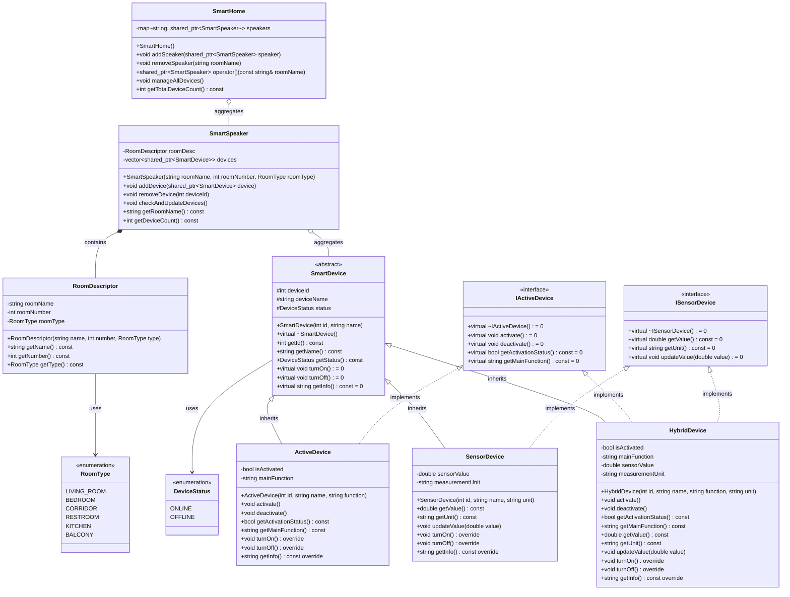

# 🏠 Smart House - Библиотека управления умным домом

Библиотека для управления умным домом на C++. Система включает управление умными колонками, устройствами различных типов и комнатами.

## 🏗️ Архитектура системы



## 📱 Основные компоненты

### Типы устройств

- **Активные устройства** - имеют основную функцию (пылесос, лампочка)
- **Устройства-датчики** - снимают показания (термометр, датчик протечки)
- **Гибридные устройства** - совмещают функции (чайник, увлажнитель)

### Управление

- **SmartHome** - главный класс системы с коллекцией колонок
- **SmartSpeaker** - умная колонка для управления устройствами в комнате
- **RoomDescriptor** - описание комнаты (имя, номер, тип)

### Особенности

- Автоматическая сортировка колонок по имени комнаты (std::map)
- Перегрузка операторов `<<` и `[]` для удобного доступа
- Автоматическое включение выключенных устройств
- Интерфейсный подход для гибридных устройств (избегает diamond problem)

## 📂 Структура проекта

```log
smart-house/
├── docs/                          # Документация и диаграммы
├── include/smart_house/           # Заголовочные файлы
├── src/                          # Исходный код
├── examples/                     # Примеры использования
└── CMakeLists.txt               # Конфигурация сборки
```

## 💡 Пример использования

```cpp
#include "smart_house/SmartHome.h"
#include "smart_house/SmartSpeaker.h"
#include "smart_house/devices/ActiveDevice.h"

int main() {
    // Создаем умный дом
    SmartHome home;
    
    // Добавляем колонку в спальню
    auto speaker = std::make_shared<SmartSpeaker>("Спальня", 1, RoomType::BEDROOM);
    home.addSpeaker(speaker);
    
    // Добавляем устройства
    auto lamp = std::make_shared<ActiveDevice>(1, "Умная лампа", "освещение");
    speaker->addDevice(lamp);
    
    // Управляем устройствами
    home.manageAllDevices();
    
    // Вывод информации о доме
    std::cout << home << std::endl;
    
    return 0;
}
```
